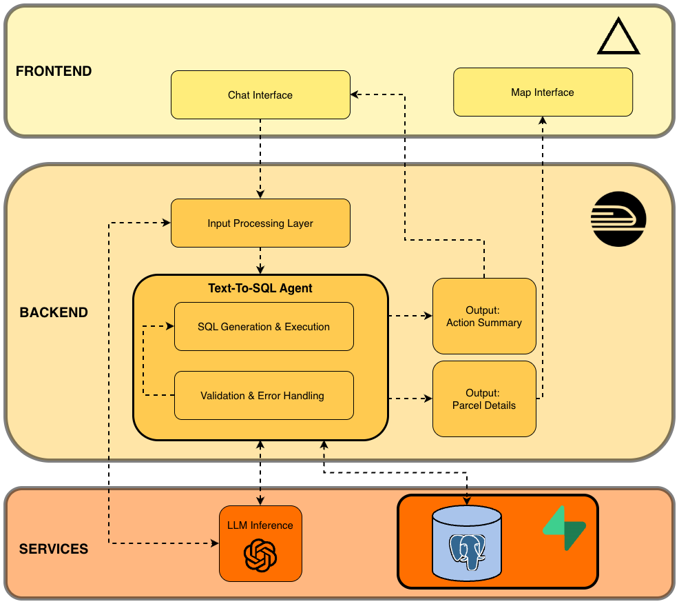
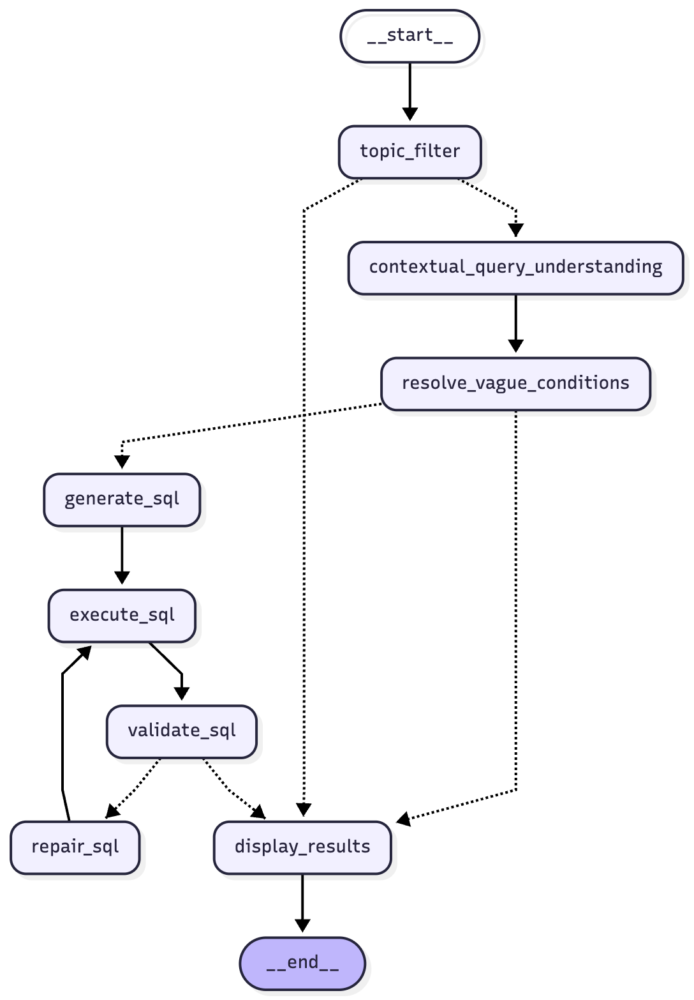

<div align="center">
  
  
  <h2>Utility-Scale Solar Site Selection Assistant</h2>
</div>

Yuma is an intelligent, production-grade text-to-SQL system for finding and analyzing land parcels suitable for large-scale solar development. This project combines advanced LLM orchestration, spatial data processing, and multi-turn conversation capabilities to create a sophisticated domain-specific AI assistant.

**Try Yuma now:** [https://yuma-solar-site-selector.vercel.app/](https://yuma-solar-site-selector.vercel.app/)

## 🎯 Key Features

### Intelligent Query Processing
- **Multi-turn Conversations**: Maintains context across queries, allowing users to refine searches incrementally
- **Topic Filtering**: Automatically rejects off-topic queries before processing
- **Vague Condition Resolution**: Detects ambiguous inputs (e.g., "Western Massachusetts") and suggests concrete interpretations
- **Unmatched Condition Detection**: Warns users when requested features don't exist in the database
- **Contextual Query Understanding**: Expands queries using conversation history for better accuracy

### Self-Healing SQL Generation
- **Automatic SQL Repair**: Detects and fixes failed SQL queries with up to 3 retry attempts
- **Multi-stage Validation**: Validates syntax, checks for empty results, and verifies schema matching
- **Semantic Schema Matching**: Maps natural language to database values (e.g., "transmission lines" → `power_line`)
- **Unit Conversion**: Handles different units automatically (acres, km, miles, etc.)

### Spatial/GIS Capabilities
- **PostGIS Integration**: Handles complex spatial queries with geometry operations
- **Interactive Map Visualization**: Leaflet-based map with parcel boundary rendering
- **Satellite Imagery Toggle**: Switch between map and aerial imagery views
- **GeoJSON Conversion**: Automatic conversion of PostGIS geometries for frontend display

### Production-Ready Features
- **Real-time Status Updates**: Server-Sent Events (SSE) for live processing feedback
- **SQL Explanation**: AI-generated natural language explanations of query logic
- **Error Handling**: Graceful degradation with helpful error messages
- **Deployment Ready**: Configured for Vercel (frontend), Render (backend) with Supabase database

## 🏗️ Architecture

### System Architecture Diagram

<div align="center">
  
</div>

### Backend (`backend/`)

**Tech Stack:**
- **Framework**: FastAPI (async web framework with automatic API documentation)
- **LLM Orchestration**: LangChain + LangGraph (state machine for multi-step AI workflows)
- **LLM Provider**: OpenAI GPT-4 (via `langchain-openai`)
- **Database**: PostgreSQL 14+ with PostGIS extension (spatial data support)
- **ORM**: SQLAlchemy 2.0+ (database abstraction layer)
- **Spatial Processing**: GeoAlchemy2 (PostGIS integration), Shapely (geometry operations)
- **Data Validation**: Pydantic 2.0+ (type-safe data models)
- **Server**: Uvicorn (ASGI server for FastAPI)
- **Environment**: Python 3.12+
- **State Management**: LangGraph MemorySaver (checkpointing for conversation state)
- **Deployment**: Render (serverless functions for backend API)
- **Database**: Supabase (PostgreSQL with PostGIS extension)

**Core Components:**
- `sql_agent.py`: LangGraph-based SQL query agent with 8-node processing pipeline
- `api_server.py`: FastAPI server with streaming support and CORS handling
- `db_actions/`: Database utilities and schema management
- `processing/`: Data processing scripts for geographic and infrastructure features
- `prompts/`: LLM prompt templates for SQL generation and validation

**LangGraph Workflow:**
<div align="center">
  
</div>


Each node performs specific validation and processing:
1. **Topic Filter**: Validates query relevance to solar parcel search
2. **Contextual Query Understanding**: Expands queries using conversation history
3. **Resolve Vague Conditions**: Detects and clarifies ambiguous inputs
4. **Generate SQL**: Converts natural language to SQL with schema awareness
5. **Execute SQL**: Runs queries against PostgreSQL/PostGIS database
6. **Validate SQL**: Multi-stage validation (syntax, results, schema matching)
7. **Repair SQL**: Auto-fixes failed queries with retry logic
8. **Display Results**: Formats output and generates explanations

### Frontend (`frontend/`)

**Tech Stack:**
- React + TypeScript
- Vite for build tooling
- Tailwind CSS + Shadcn UI components
- Leaflet/React-Leaflet for map visualization

**Key Components:**
- `ChatInterface.tsx`: Main chat interface with SSE streaming support
- `MapView.tsx`: Interactive map with parcel boundary rendering
- `OnboardingModal.tsx`: Help/onboarding dialog
- `AvailableFeaturesModal.tsx`: Feature documentation

### Database

**PostgreSQL with PostGIS Extension**

**Schemas:**
- `parcels`: Parcel details (address, acreage, value, capacity, geometry)
- `geographic_features`: Land cover, land use, flood zones, open spaces, priority habitats, prime farmland
- `infrastructure_features`: Grid infrastructure (substations, power lines), transportation infrastructure

## 📊 Data Sources

Yuma integrates data from multiple authoritative sources to provide comprehensive parcel analysis:

- [**Parcels**](https://www.mass.gov/info-details/massgis-data-property-tax-parcels)
- [**Administrative Boundaries**](https://www.mass.gov/info-details/massgis-data-municipalities)
- [**Parcel Suitability**](https://technicalpotentialofsolar-ma-synapse.hub.arcgis.com/datasets/49388e675c5a493983a252d5acf64418/about)
- [**FEMA Flood Zones**](https://www.mass.gov/info-details/massgis-data-fema-national-flood-hazard-layer)
- [**Protected Open Space**](https://www.mass.gov/info-details/massgis-data-protected-and-recreational-openspace)
- [**Priority Habitats**](https://www.mass.gov/info-details/massgis-data-nhesp-priority-habitats-of-rare-species)
- [**Prime Soils**](https://gis.data.mass.gov/datasets/prime-farmland-soils-feature-service/explore)
- [**Infrastructure**](https://docs.overturemaps.org/schema/reference/base/infrastructure/)
- [**Land Use / Land Cover**](https://docs.overturemaps.org/schema/reference/base/land_cover/)

## 📖 Usage

### Live Application

**Production Endpoint:** [https://yuma-solar-site-selector.vercel.app/](https://yuma-solar-site-selector.vercel.app/)

The application is live and ready to use. Simply open the link above and start searching for solar parcels using natural language queries.

### Basic Query Examples

```
Find parcels over 20 acres in Franklin county
```

```
Search for 25+ acre parcels within 1 km of a substation in Pittsfield, MA
```

```
Find me 20+ acre sites within industrial zones in Franklin County
```

```
Find parcels over 30 acres in Franklin county that are at least 2km from any wetlands or flood zones
```

### Multi-turn Conversations

The system maintains context across queries:

**User:** "Find parcels above 20 acres in Worcester county"

**User (follow-up):** "Actually, make that 30 acres"

The system automatically combines the filters: parcels in Worcester county above 30 acres.

### Query Features

**Parcel Details:**
- Size (acres)
- Location (town, county)
- Total land value
- Capacity (ground-mount solar capacity in kW)

**Geographic Features:**
- Land cover (wetlands, forests, etc.)
- Land use (industrial, commercial, residential, etc.)
- Flood zones
- Open spaces (conservation lands, recreational facilities)
- Priority habitats (rare and endangered species)
- Prime farmland soils

**Infrastructure:**
- Grid infrastructure (substations, power lines)
- Transportation infrastructure (highways, roads)

## 🔌 API Endpoints

### POST `/api/search`

Search for parcels using natural language query with streaming support.

**Request:**
```json
{
  "query": "Find parcels over 20 acres in Franklin county",
  "session_id": "optional-session-id-for-multi-turn-conversations"
}
```

**Response (Server-Sent Events):**

Status updates:
```
data: {"type": "status", "step": "Checking topic filters"}
data: {"type": "status", "step": "Constructing Contextual Query"}
data: {"type": "status", "step": "Generating SQL query"}
data: {"type": "status", "step": "Executing query"}
```

Final result:
```json
{
  "type": "result",
  "parcels": [
    {
      "address": "123 Main St",
      "county": "FRANKLIN",
      "acreage": 25.5,
      "municipality": "Greenfield",
      "owner_name": "John Doe",
      "total_value": 150000,
      "capacity": 5000,
      "geometry": {
        "type": "Polygon",
        "coordinates": [[[-72.456, 42.123], ...]]
      }
    }
  ],
  "summary": "Found 1 parcel matching your criteria.",
  "sql": "SELECT ...",
  "sql_explanation": "I searched for parcels in Franklin county that are over 20 acres...",
  "session_id": "session-id"
}
```

### GET `/api/health`

Health check endpoint that verifies:
- Environment variables
- Database connectivity
- SQL agent import status

**Response:**
```json
{
  "status": "ok",
  "environment_variables": {
    "DB_HOST": true,
    "DB_USER": true,
    "OPENAI_API_KEY": true
  },
  "sql_agent_loaded": true
}
```

## 🧪 Testing

### Test Backend

```bash
./test_backend.sh
```

Or manually:
```bash
python test_api.py
```

### Test SQL Agent

```bash
cd backend
python -m tests.query_tester
```

## 🚢 Deployment

The application is currently deployed with:
- **Frontend**: Vercel (https://yuma-solar-site-selector.vercel.app/)
- **Backend**: Render (API endpoints at `/api/*`)
- **Database**: Supabase (PostgreSQL with PostGIS)


## 📧 Contact

Email: dhense177@gmail.com

Linkedin: https://www.linkedin.com/in/david-henslovitz/
